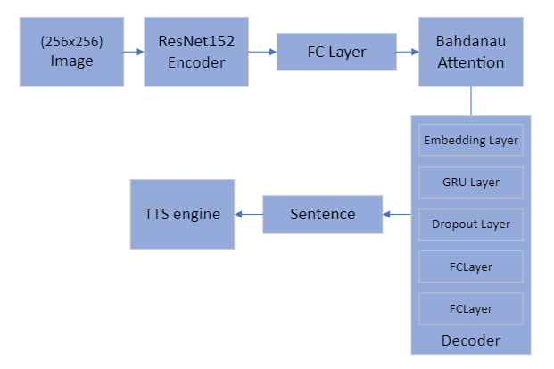
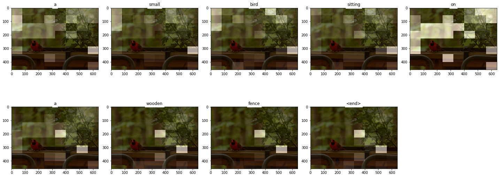
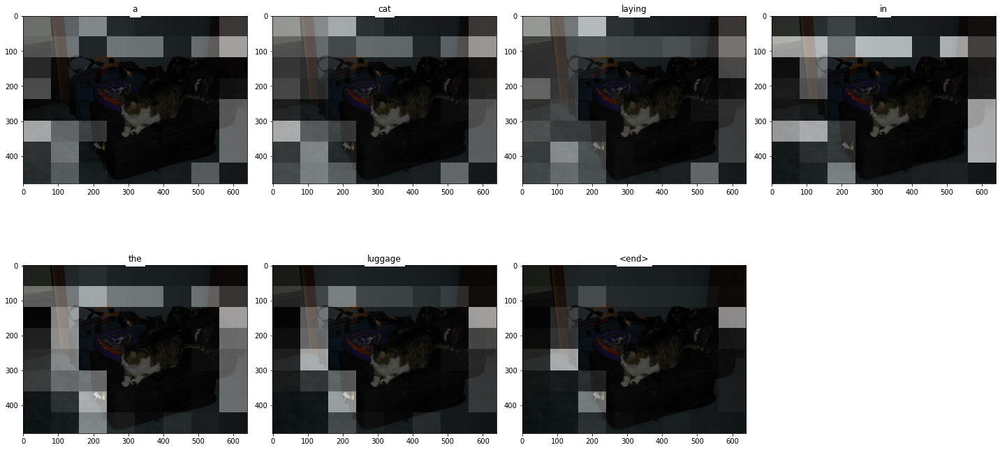

# unlimited-vision

### Introduction

This is a image captioning model, using a transformer model.

It consist of an encoder-decoder with attention.

### Architecture

ResNet152 as a feature extractor, Bahdanau attention, and a GRU.

here is the full architecture:

Here are some output samples:

